# multivocal-example-auth0

This project is a demonstration about how to use multivocal to do 
authentication with the Auth0 service and Actions on Google.

Prerequisites:

* A project in the Action Console.
* An account and project on Auth0.
* We will use Firebase Cloud Functions
    * Since we are doing network calls, this requires a paid plan.
    * Changes for Google Cloud Functions, AWS Lambda,
        or other node.js hosting platforms are minimal. See multivocal
        documentation for details.

## Setup Auth0

1. In Auth0, you will either need to use an existing Tenant, or create
    a new one. The Tenant is the logical isolation unit for Auth0
    projects and helps form the OAuth Domain Name tht is used. If you
    have an existing web or mobile app that your Action will be working
    with, they should share the same Tenant. If you're creating a new
    project, it should be a new Tenant.
    
    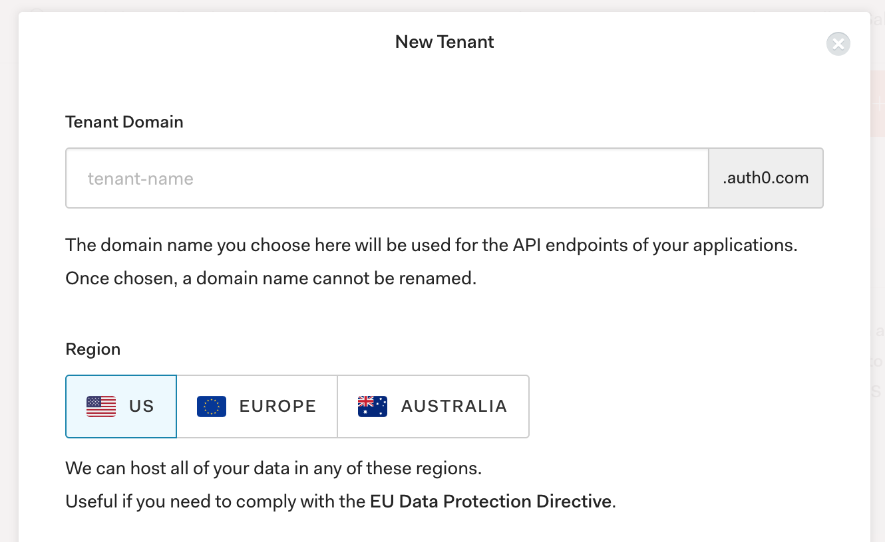
    
2. From your Dashboard, click the button to create a new application

    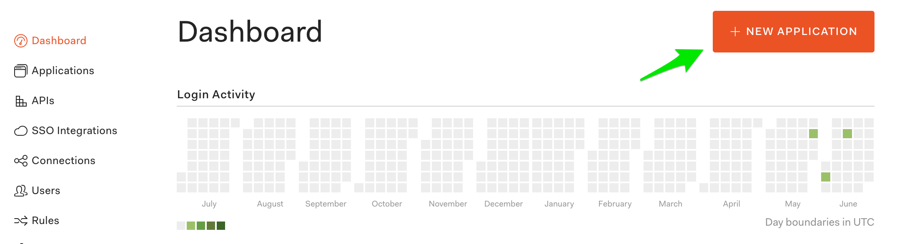
    
    and then fill in the name of the application. This will be displayed
    to the user, but can be changed later. Then select a "Regular
    Web Application" and click the create button.
    
    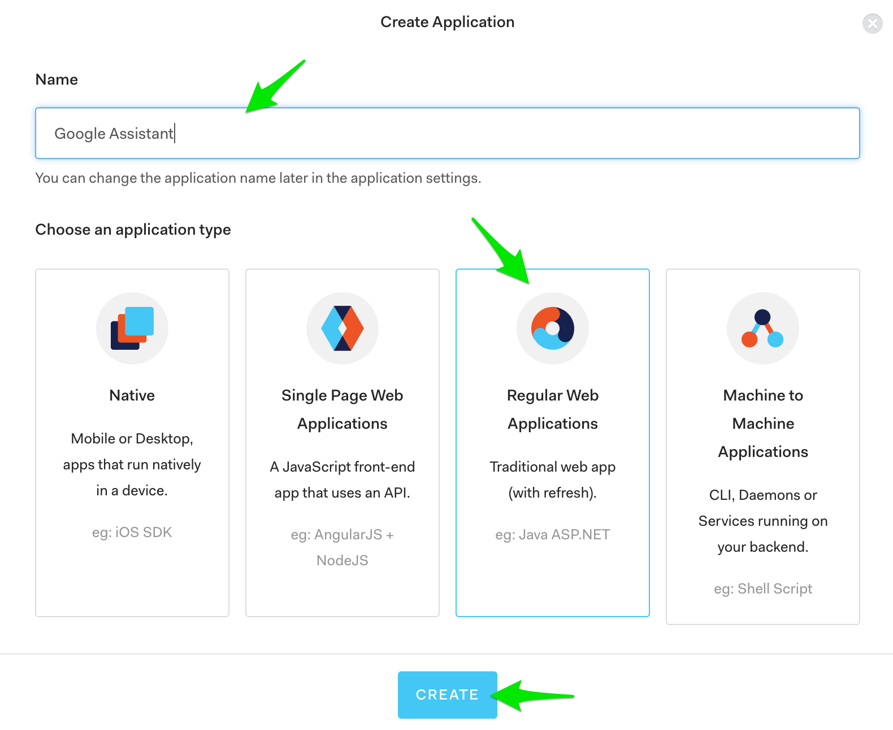
    
3. You'll be placed on the Quick Start page for the application you
    just created. Click on the "Settings" tab for the application
    instead.
    
    You will need some of these settings when we setup the Action in
    the Actions Console shortly and you'll need to make one configuration
    change.
    
    At the top of the settings page, you'll need the "Client ID" and
    "Client Secret".
    
    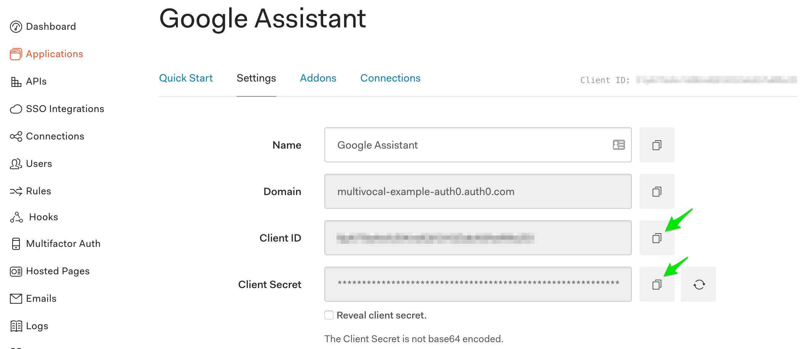
    
    Towards the middle of the page, you'll need to set the "Allowed
    Callback URLs" to a URL that includes your Actions on Google
    project ID: `https://oauth-redirect.googleusercontent.com/r/ID`
    
    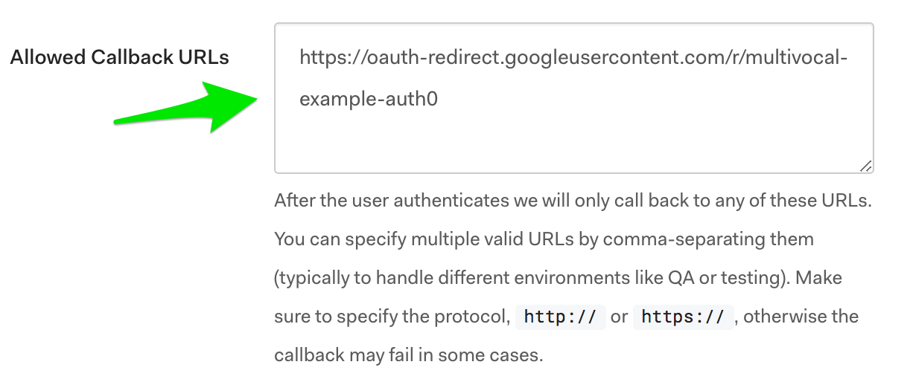
    
    We will also need to get the URLs that are located under the
    Advanced Settings by going to the bottom of the page and clicking
    on the "Advanced Settings" link.
    
    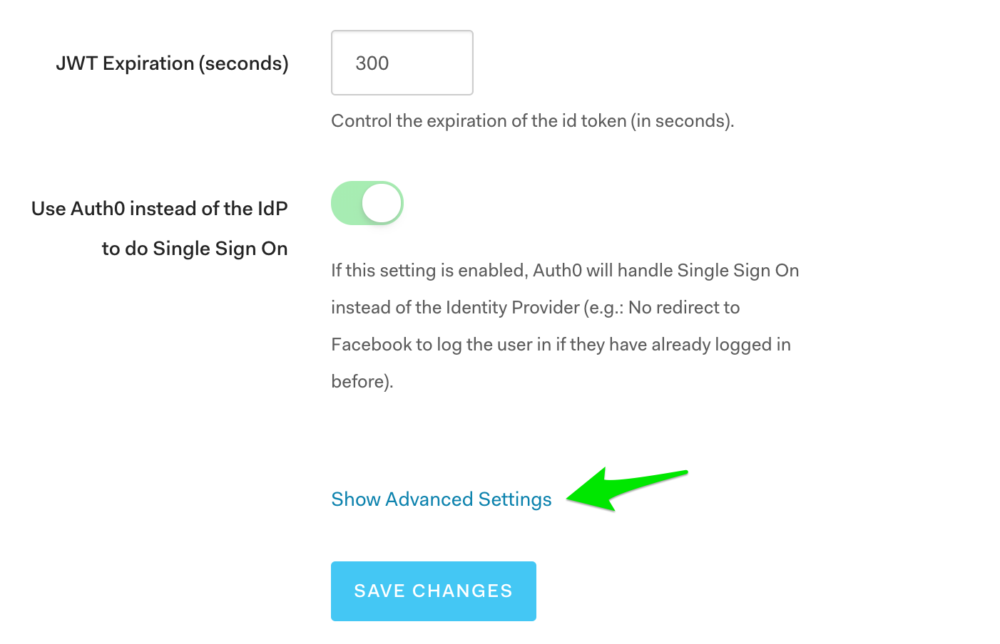
    
    In the Advanced Settings page, select the Endpoints tab and get
    the "OAuth Authorization URL" and "OAuth Token URL"
    
    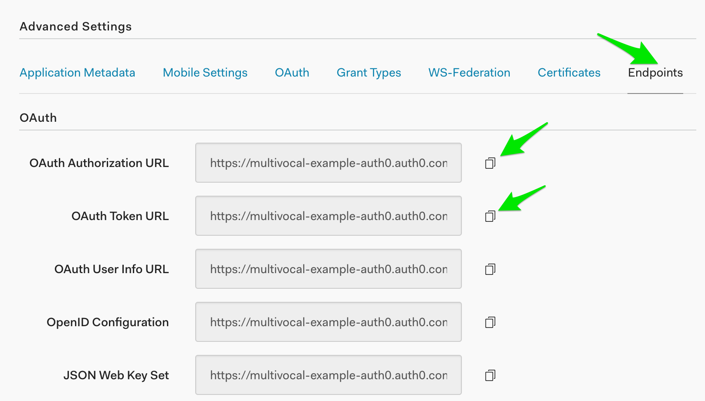
    
4. Make sure you have social connections enabled to allow people to
    login using different login providers. Select "Connections" and
    then "Social" on the left navigation. Make sure at least one of
    the providers is on - we've selected Google in this example.
    
    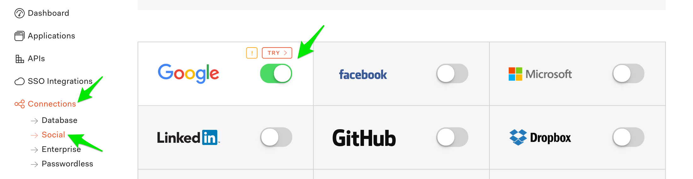
    
## Setup Actions on Google

1. In the Actions on Google console, you'll select the Account linking
    left navigation (possibly scrolling to the bottom to get to it).
    
    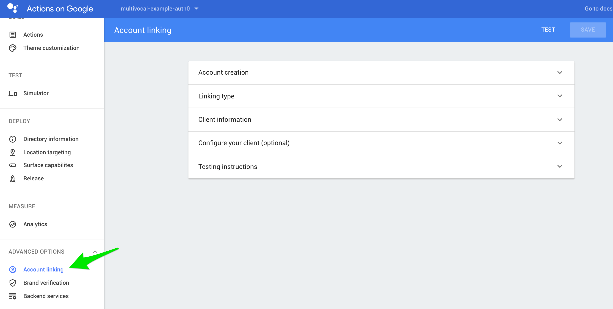
    
2. Expand the Account Creation section and set "No, I only want to
    allow account creation on my website". This will actually mean
    that they need to log into Auth0 to create the account.
    
    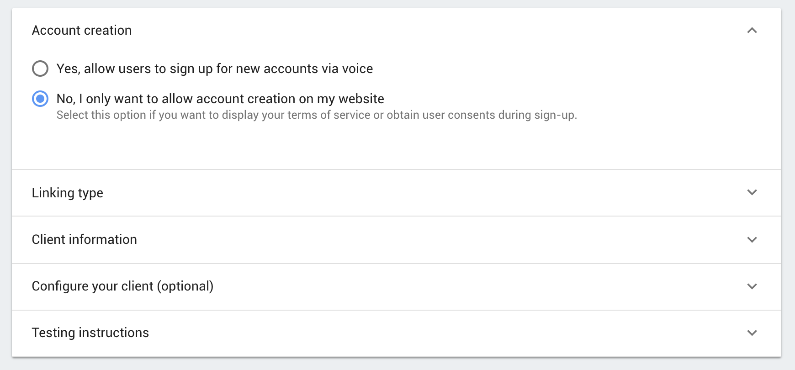
    
3. Expand the Linking Type section and make sure that "OAuth" and
    "Authorization code" are selected.
    
    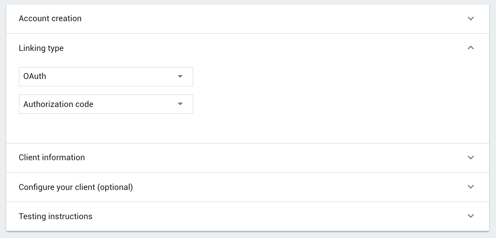
    
4. Expand the Client Information section and set the "Client ID",
    "Client Secret", "Authorization URL", and "Token URL" from the
    Auth0 setting screens we collected in step 3 of the Auth0
    instructions above.
    
    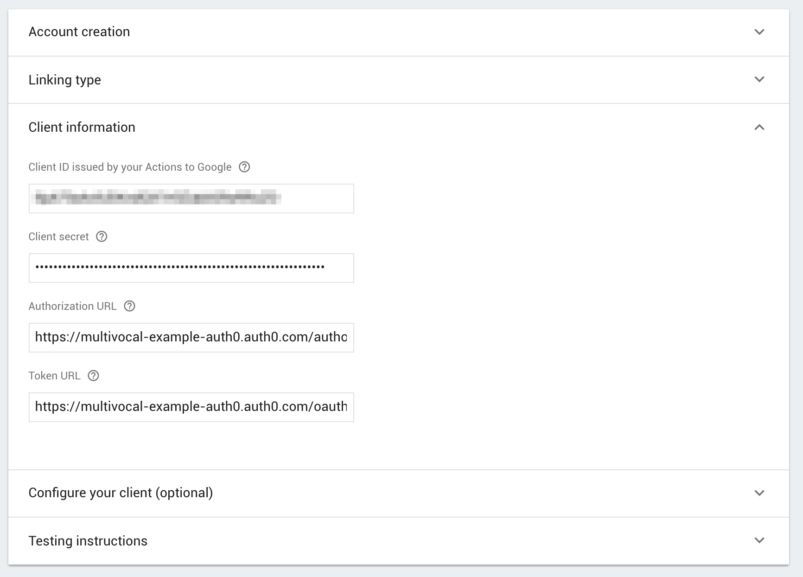
    
5. Expand the Configure your Client section and set the following
    scopes (one per block)
    
    * profile
    * email
    * openid
    * offline_access
    
    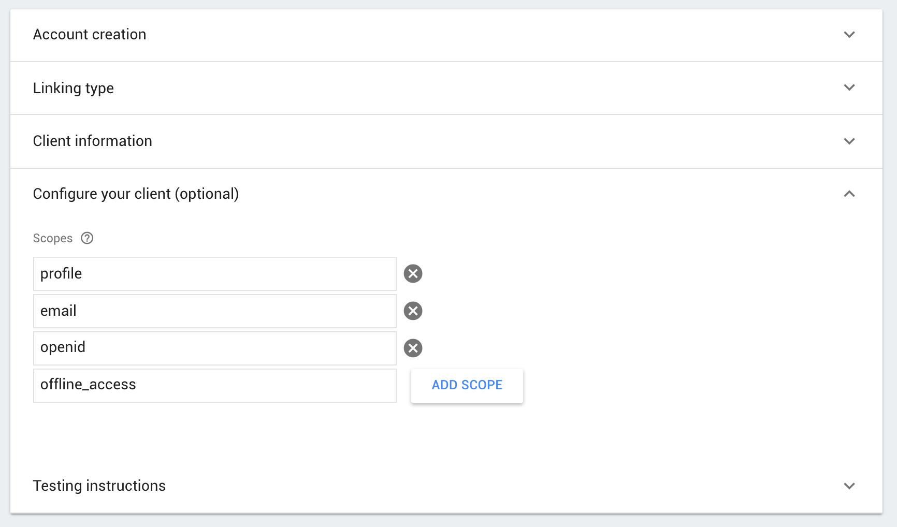
    
6. In the Testing Instructions section, you will need to provide
    information to Google's review team before they approve your
    Action. This should include a test account you've created for
    them to use.
    
    You have to put something in this field for now.
    
    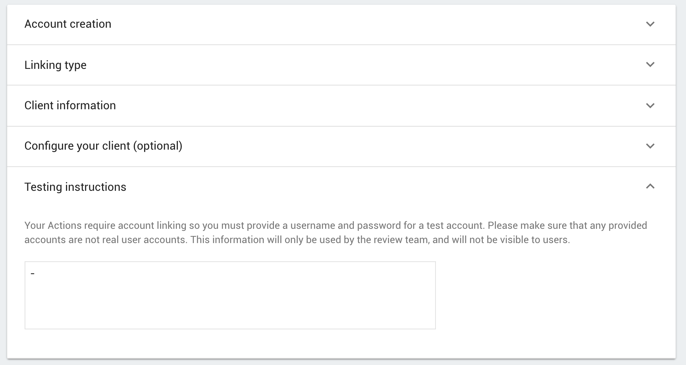
    
## Write and Configure your Action

