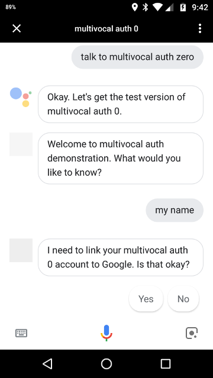
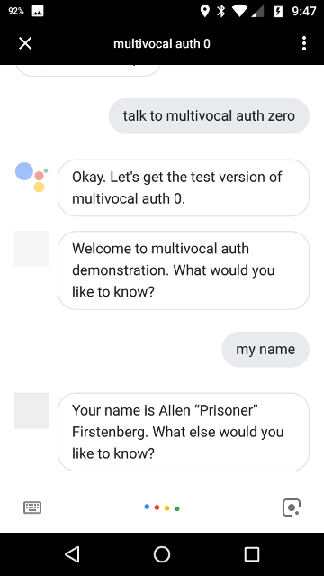

# multivocal-example-auth0

This project is a demonstration about how to use multivocal to do 
authentication with the Auth0 service and Actions on Google.

## Before you code

Before you begin coding, there is a bit of setup you'll need to do

### Prerequisites

* A project in the Action Console.
* An account and project on Auth0.
* We will use Firebase Cloud Functions
    * Since we are doing network calls, this requires a paid plan.
    * Changes for Google Cloud Functions, AWS Lambda,
        or other node.js hosting platforms are minimal. See multivocal
        documentation for details.
* For this example, check the project out from github:
     `git clone https://github.com/afirstenberg/multivocal-example-auth0.git`

### Setup Auth0

1. In Auth0, you will either need to use an existing Tenant, or create
    a new one. The Tenant is the logical isolation unit for Auth0
    projects and helps form the OAuth Domain Name tht is used. If you
    have an existing web or mobile app that your Action will be working
    with, they should share the same Tenant. If you're creating a new
    project, it should be a new Tenant.
    
    
    
2. From your Dashboard, click the button to create a new application

    
    
    and then fill in the name of the application. This will be displayed
    to the user, but can be changed later. Then select a "Regular
    Web Application" and click the create button.
    
    
    
3. You'll be placed on the Quick Start page for the application you
    just created. Click on the "Settings" tab for the application
    instead.
    
    You will need some of these settings when we setup the Action in
    the Actions Console shortly and you'll need to make one configuration
    change.
    
    At the top of the settings page, you'll need the "Client ID" and
    "Client Secret".
    
    
    
    Towards the middle of the page, you'll need to set the "Allowed
    Callback URLs" to a URL that includes your Actions on Google
    project ID: `https://oauth-redirect.googleusercontent.com/r/ID`
    
    
    
    We will also need to get the URLs that are located under the
    Advanced Settings by going to the bottom of the page and clicking
    on the "Advanced Settings" link.
    
    
    
    In the Advanced Settings page, select the Endpoints tab and get
    the "OAuth Authorization URL" and "OAuth Token URL"
    
    
    
4. Make sure you have social connections enabled to allow people to
    login using different login providers. Select "Connections" and
    then "Social" on the left navigation. Make sure at least one of
    the providers is on - we've selected Google in this example.
    
    
    
### Setup Actions on Google

1. In the Actions on Google console, you'll select the Account linking
    left navigation (possibly scrolling to the bottom to get to it).
    
    
    
2. Expand the Account Creation section and set "No, I only want to
    allow account creation on my website". This will actually mean
    that they need to log into Auth0 to create the account.
    
    
    
3. Expand the Linking Type section and make sure that "OAuth" and
    "Authorization code" are selected.
    
    
    
4. Expand the Client Information section and set the "Client ID",
    "Client Secret", "Authorization URL", and "Token URL" from the
    Auth0 setting screens we collected in step 3 of the Auth0
    instructions above.
    
    
    
5. Expand the Configure your Client section and set the following
    scopes (one per block)
    
    * profile
    * email
    * openid
    * offline_access
    
    
    
6. In the Testing Instructions section, you will need to provide
    information to Google's review team before they approve your
    Action. This should include a test account you've created for
    them to use.
    
    You have to put something in this field for now.
    
    
    
## Write and Configure your Action

The Action is a fairly simple one. After starting, you'll be prompted
if you want to hear the name or the email address that it has for you.
So our two intents are

* user.email
* user.name

### Additional Dialogflow intents

Make sure you have already loaded the multivocal standard intents.

To load the additional intents for this Action, click on the gear
to open the project settings and select "Export and Import" then
"Import From ZIP".

**IMPORTANT** Make sure you "Import" the zip file, not "Restore".
Importing the file will add it to other intents that are already
defined.


The intents to import are under `dialogflow/multivocal-example-auth0.zip`.
Select this, type "IMPORT" into the text field, and click on the "Import"
button. Then save.


### index.js

Turning to the code, our index file is
fairly straightforward and minimalist. Most of the work will be done
in the `config.js` file, which gets initialized here.

```
const Multivocal = require('multivocal');

require('./config.js').init();

exports.webhook = Multivocal.processFirebaseWebhook;
```

### auth0.js

Before we look at the config, we'll look at this separate auth0.js
file. You don't need to edit anything in the file, in fact, you can
copy it directly to your own projects and reuse it unchanged, but it
is useful to look at to see how it works.

We can see that it comes with a simple configuration. In this case, it
is an environment setting for the URL to use to get user information:
`Config/Setting/auth0/userinfoUrl`.

But this value is, itself, a template, that references `Config/Setting/auth0/tenant`,
which is not defined in this file. We'll need to provide it ourselves
in the configuration since this is distinct per project. We could also
provide the whole URL by setting `Config/Setting/auth0/userinfoUrl`,
but this is only necessary if we customize it in auth0.

We also see that it registers a builder. If we get an access token from
Google, then we'll request the user information from auth0 for this
token. If it succeeds, we'll store this in the environment under
`User/Profile`.

### config.js

The important bits are all in the configuration file. We won't go into
everything, but a few important things to note.

In multivocal, we say that it is a "reqiurement" to be authenticated
before we get the results for some intents. So we define them in
the configuration under `Local/und/Requirements`. Requirements can
be localized, although they often aren't, so we include them in the
"und" section.

We have two intents that need the user to be authenticated, "user.name"
and "user.email". So our requirements section includes them and says
that the environment setting `User/IsAuthenticated` must be set.

```
  "Intent.user.email": "User/IsAuthenticated",
  "Intent.user.name":  "User/IsAuthenticated"
```

`User/IsAuthenticated` will only be set if either the auth token or the
identity token have been set, and multivocal knows to prompt the user
to sign in to get this set.

In our responses, we'll include values from the `User/Profile`
environment setting, which is set by the auth0 builder.

```
  "Intent.user.email": [
    "Your email address is {{User.Profile.email}}."
  ],
  "Intent.user.name": [
    "Your name is {{User.Profile.name}}."
  ]
```

We also need to set `Config/Setting/auth0/tenant` so the
auth0 module knows which to use when fetching user info.

```
  Setting:{
    auth0:{
      tenant: 'multivocal-example-auth0'
    }
  }
```

And finally, of course, we need to initialize the auth0 component.

## Trying it out

Since we are doing account linking that requires OAuth, we need to try
it out on a phone. (We can try it on our speaker, like Google Home,
but it will say that we need to complete it on the phone anyway.)

We start the Action by explicitly asking for it, and then asking
for my name.

Since our account isn't yet linked, it asks for permission to begin
the linking process.



We can say or click on "Yes", which will open a web page attached
to this Auth0 tenant. We'll select the "Login with Google" button
and do any login tasks that may be necessary.


Once login is complete, we're redicted back to the Assistant, which
completes the login and sends the auth token to our Action. Since
multivocal now gets the auth token, it gets the profile information,
determines the response for the intent we originally wanted, and handles
that response.


If we quit the Action and start over, we'll see that the Assistant
still knows who we are. So when we ask for our name, it doesn't require
that we log in.


